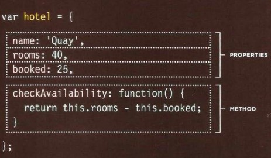
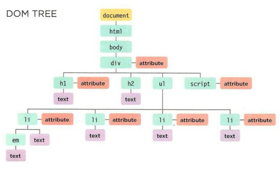

# OBJECTS
- ## JavaScript objects are containers for named values called properties or methods.
- ## A method is a function stored as a property.
- ## Variables known as a properites.
- ## The names known as keys and each key has a value.

 

## The Document Object Model (DOM)
 
 - ## When a web page is loaded, the browser creates a Document Object Model of the page.

