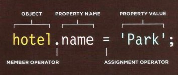
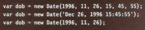

# TABLES
- ## HTML tables allow web developers to arrange data into rows and columns.
- ## The < table > tag defines an HTML table.
- ## Each table row is defined with a < tr > tag.
- ## Each table header is defined with a < th > tag.
- ## Each table data/cell is defined with a < td > tag.
<!-- // https://www.w3schools.com/html/html_tables.asp -->
- ## Each block in the grid is referred to as a table cell
- ## We can structure the table as head, body and table.
---
# OBJECTS
- ## We can update the object by dot nation or square brackets.
 - ### dot nation
 
 - ### square brackets

- ## Object constructors can create objects and assign the properties and methods.
- ## We use the ( this ) keyword instead of the object name in side the object.
- ## we can write inside the html from js by .textContent .
- ## There are two ways to create objects literal notaion or object constructor notaion.
- ## Arrays are type of objects.
- ## Browser object model (BOM) allows JavaScript to "talk to" the browser by creates a model of th browser tab and windos.
- ## Document object model (DOM) creates a model of the current web page .
- ## In order to work with dates we will use the date obj Date ().
- ## We can use the following formats
 

