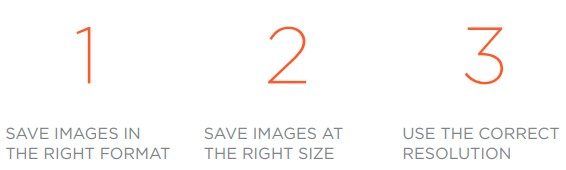

# IMAGES
- ## When we want to use images in html we should consider:
  - ### The image format (jpeg, gif, or png).
  - ### The size of the image.
  - ### Optimize the image to make the pages load faster.
 

- ## For best practice make a folder for the images.
- ## To add an image we will use < img > tag.
- ## we can specify the size of the image by height and width attributes.
- ## Whenever you have many different colors in a picture you should use a JPEG.
- ## Use GIF or PNG format when saving images with few colors or large areas of the same color.
- ## We can use < figcaption > to add a caption to an image.
---
# COLORS
- ## The color property allows you to specify the color of text inside an element.
- ## There are three ways to specify any color in CSS : 
  - ### rgb values **rgb(0,0,0)**
  - ### hex codes **#000000**
  - ### color names **black**
- ## RGB Values : Values for red, green, and blue are expressed as numbers between 0 and 255. 
- ## Saturation refers to the amount of gray in a color.
- ## Brightness refers to how much black is in a color. 
- ## It is important to ensure that there is enough contrast between the background and the text.
- ## Lightness is the amount of white or black in a color.(lightness is a different concept to brightness).
---
# TEXT
- ## There are three types of the fonts
 - ### Serif 
 - ### Sans-Serif
 - ### Monospace
 
- ## We can set the font-size by pixels, percentages or ems.
- ## The default size of text in a browser is 16 pixels.
- ## font-weight colud be Normal or Bold.
- ## font-style ccoludan be normal, italic or oblique.
- ## We colud change the case of the letters by the text-transform to uppercase, lowercase or capitalize.
- ## text-decoration colud be underline, overline, line-through, blink or none to remove any decoration.
- ## Increasing line-height amount can make text easier to read.
- ## text-align colud be left, right, center or justify.
- ## vertical-align is commonly used with inline elements.
- ## We can specify values for the first letter of textby first-letter.

 

