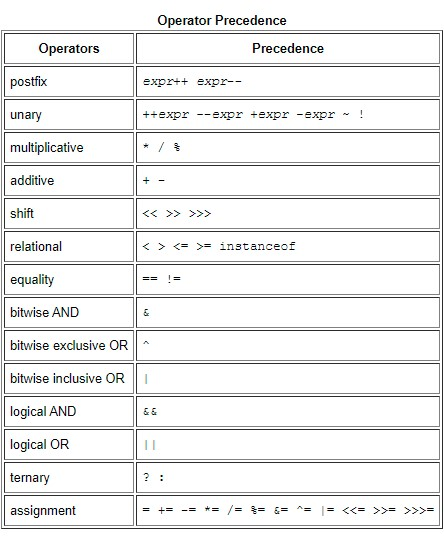

# Language Basics

## Variables

- Java Main Data Types :
  - Primitive Data Types
  - Non-Primitive Data Types (reference types)
  - Primitive types are predefined (already defined) in Java. Non-primitive types are created by the programmer and is not defined by Java (except for String).
 
- Naming :
  - Variable names are case-sensitive.
  - Variable must not be a keyword or reserved word.

## Operators
- Operators are used to perform operations on variables and values.
- The operators in the following table are listed according to precedence order.

## Expressions, Statements, and Blocks
- Expressions are the core components of statements.
- Statements may be grouped into blocks.
- An expression is a construct made up of variables, operators, and method invocations.
- Statements are roughly equivalent to sentences in natural languages.
- A block is a group of zero or more statements between balanced braces and can be used anywhere a single statement is allowed.

## Control Flow Statements
- The statements inside your source files are generally executed from top to bottom, it will breal the flow in some cases such as looping statements and the branching statements.
