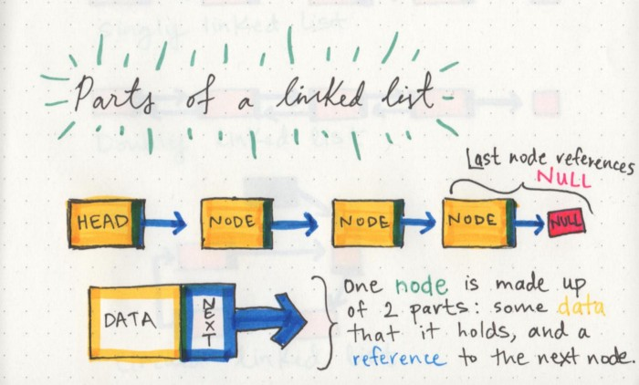
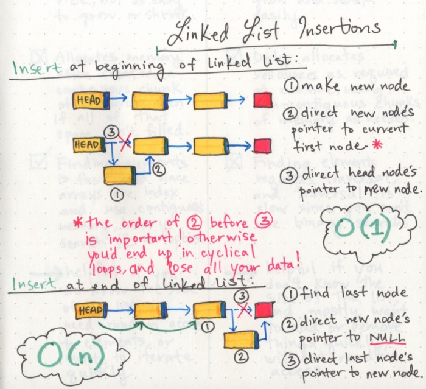

# Linked Lists

- Linked List - A data structure that contains nodes that links/points to the next node in the list.
- There are two types of Linked List - Singly and Doubly
  - Singly linked list means that there is only one reference, and the reference points to the Next node in a linked list.
  - Doubly linked list means that there is a reference to both the Next and Previous node.
- Nodes are the individual items/links that live in a linked list. 
- The best way to approach a traversal is through the use of a while() loop.
- The biggest differentiator between arrays and linked lists is the way that they use memory in our machines; When an array is created we’d need 7 bytes of memory in one contiguous block,when a linked list is born,it doesn’t need 7 bytes of memory all in one place. 
- The fundamental difference between arrays and linked lists is that arrays are static data structures, while linked lists are dynamic data structures.
- what allows a linked list to have its memory scattered everywhere?
- A linked list is made up of a series of nodes, which are the elements of the list.
- Nearly all linked lists must have a head, because this is effectively the only entry point to the list and all of its elements.

- A node only knows about what data it contains, and who its neighbor is.

# Big O Notation

- Big O Notation is a way of evaluating the performance of an algorithm.
- There are two major points to consider when thinking about how an algorithm performs: how much time it requires at runtime given how much time and memory it needs.
- we can insert an element into a linked list: at the very beginning and at the end as following images steps

